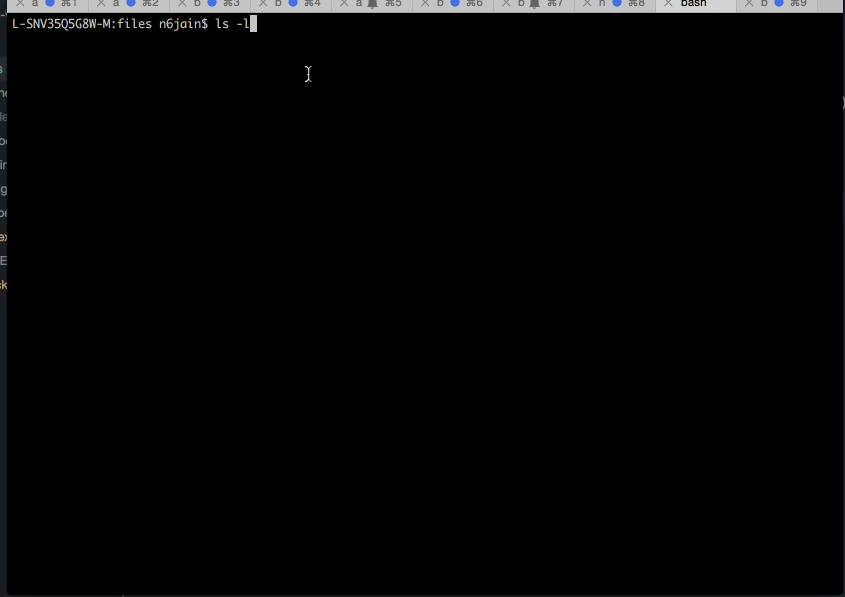

# Week 2 Challenge - VFS Server


Time spent: 3 hours

Completed:

* [x] Required: GET
* [x] Required: PUT
* [x] Required: POST
* [x] Required: DELETE


Walkthrough Gif:




## How To Use:

### Setup

1. Follow the [Node.js Setup Guide](http://guides.codepath.com/nodejs/Setup)
1. Clone the repo:

    ```bash
    git clone https://github.com/jnitin29/nodejs-vfsserver.git
    ```


1. Run:

    ```bash
    npm start
    ```
2. Run following CURLs

    ```bash
    echo 'To node.js and beyond!' > files/hello.txt
    curl http://127.0.0.1:8000/hello.txt
    curl -X PUT http://127.0.0.1:8000/create/a.txt
    ls -l
    curl -X POST -d "data=hello, how are you?" http://127.0.0.1:8000/update/a.txt
    cat a.txt
    ls -l
    curl -X DELETE  http://127.0.0.1:8000/delete/a.txt
    ls -l    
    ```
